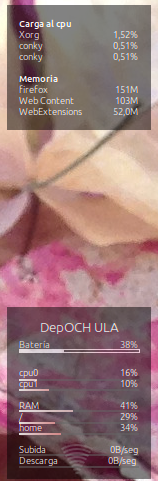

# DropRain tema Conky

Configuración de tema de conky con barras horizontales en la esquina de abajo a la derecha y al medio a la derecha la información de carga del sistema.

# Invocar
Usar el comando start.sh para iniciar ambos cuadros de información.

# VIsta preliminar

# Código modificado
El tema original fue publicado por wim66.
[Ver el tema original.](https://www.deviantart.com/wim66/art/Conky-bars-sample-653066719)
